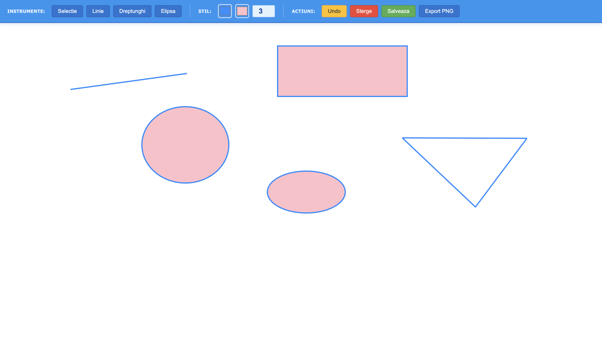

#  Web-based SVG Vector Graphics Editor

A fully functional, client-side vector graphics editor built entirely with HTML5 `SVG`, CSS, and Vanilla JavaScript. This project allows users to create, edit, and export vector graphics directly in the browser, offering a seamless and interactive design experience.

##  Preview

##  Key Features

* **Draw Basic Shapes:** Support for adding basic geometric elements such as lines, ellipses, and rectangles.
* **Custom Paths:** Advanced support for drawing paths with the ability to edit control points later.
* **Customization:** Select and apply line color, line thickness, and background/fill color before or after drawing.
* **Element Manipulation:** * Select existing elements on the canvas.
  * Modify properties of selected elements (stroke color, stroke width, fill color).
  * Delete unwanted elements.
* **Drag & Drop:** Move elements freely around the canvas using the mouse.
* **Undo System:** Revert the last *n* operations to easily fix mistakes.
* **Auto-Save & Persistence:** Automatically saves the current drawing using the **Web Storage API** (Local Storage) and reloads it when the application restarts.
* **Export & Save:**
  * Save the drawing in native vector format (`.svg`).
  * Export the canvas to raster formats (`.png` or `.jpeg`).

##  Technologies Used

* **HTML5:** App structure and the `<svg>` element for rendering vector graphics.
* **CSS3:** User interface styling.
* **JavaScript (ES6+):** Core application logic, DOM manipulation, mouse event handling, Undo algorithms, and Web Storage integration.

##  How to Run

Since this is a client-side application without a backend, running it is straightforward:

1. Clone this repository: `git clone https://github.com/adda987/SVG-Editor.git`
2. Open the project folder.
3. Open `index.html` in any modern web browser.
